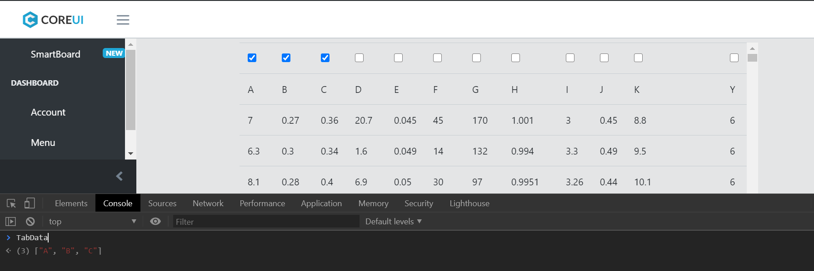

# Description
SmartBoard is a smart business dashboard that allows users to apply one or more Data Science algorithms to a dataset (e.g. Regression, Clustering, Classification, Association) to solve a business data problem (such as fraud detection, sales forecasting, customer segmentation ... etc).
#	Objectif
•	Provide an easy to use yet powerful solution for Data Analytics using a predefined algorithms and ready to use data model  for most common data problem. 
#	How it works?
•	Companies can upload their data to the dashboard (via http or ftp) in different formats (csv, xlsx)
•	They can then select an appropriate algorithm (Regression, Classification, Clustering, Association) to solve a specific business data problem (things like: Fraud detection, Customer Segmentation, Sales forecast)
•	Generate a Machine Learning model for different purposes (Prediction, Classification…etc.)
•	Save the generated data model for further analysis (each user/company has his own space to store and restore data model)
•	Use the predefined model on a new uploaded dataset for analysis
# Show selected columns
• This screenshoot shows the columns we selected 

# Install the requirements inside the app folder
• $ pip install -r requirements.txt
